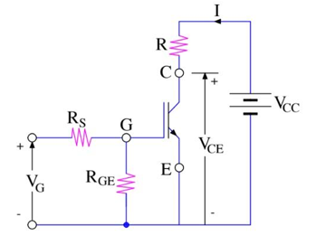
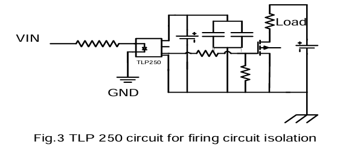
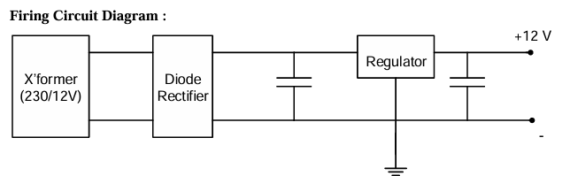

# Study of IGBT Characteristics

This folder contains MATLAB simulations and hardware lab results for the study of Insulated Gate Bipolar Transistor (IGBT) characteristics. The experiment focuses on understanding the switching behaviour, transient response, and operating principles of an IGBT.

---

## Objective
To determine the characteristics of a given IGBT and measure key switching parameters such as rise time and fall time.

---

## Apparatus Used
- IGBT  
- Resistors  
- Transformer  
- Diodes & Zener Diodes  
- Capacitors  
- TLP250 Gate Driver  
- DSO (Digital Storage Oscilloscope)  
- Function Generator  

---

## Theory
The IGBT combines the advantages of MOSFET and BJT:
- High input impedance like a MOSFET  
- Low on-state conduction losses like a BJT  
- Voltage-controlled device  
- No second-breakdown problem (unlike BJT)  
- Lower switching and conduction losses compared to power MOSFETs  
- Faster switching than BJTs  

IGBTs are widely used in medium-power motor drives, power supplies, relays, and AC/DC converters.  
In forward operation, the IGBT behaves similar to a logic-level BJT but is controlled using **gate-to-emitter voltage** instead of base current.

---

## Circuit Diagrams Included
- Simplified equivalent circuit of IGBT - 

- TLP250 isolation and gate-driving circuit - 
- Pulse Firing circuit - 

---

## Observation Table

| Freq (kHz) | VG (V) | Tr (µs) | Tf (µs) | VCE (V) | IC (A) | VF (V) | IF (mA) |
|-----------|-------------------|---------------------|---------------------|---------------------|-------------------|-------------------|---------------------|
| 15        | 110               | 14.35               | 10                  | 1V                  | 1.082             | 111               | 100                 |

---

## Calculations
- **Rise Time (Tr)**  
\[
T_r = T_2 - T_1 = 81.23 - 66.88 = 14.35 \, mu s
\]

- **Fall Time (Tf)**  
\[
T_f = T_2 - T_1 = 7 - (-3) = 10 \, mu s
\]

---

## Results
1. Characteristics of the given IGBT were obtained successfully.  
2. **Rise Time:** 14.35 µs  
3. **Fall Time:** 10 µs  

---

## Files in This Folder
- `/MATLAB_Simulation/` – Simulink files
- `/Circuit_Images/` – Circuit diagrams referenced
- `/README.md/` – Report of experiment performed in power electronics lab course

---

## Notes
This experiment providies practical insight into real-world switching behaviour of IGBTs, complementing MATLAB-based analysis.
